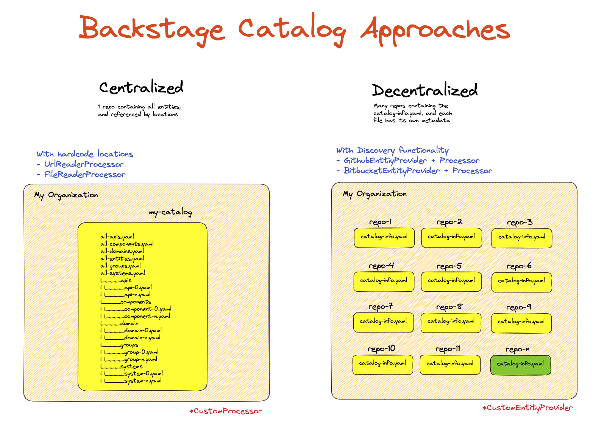

# Backstage Huge Catalog

This repo represents a huge catalog of components, apis, teams, domains and systems to simulate a real world backstage instance.

I have defined 2 approaches to use this catalog:

1. Centralized catalog
2. Decentralized catalog

For more information about the approaches, please check the `excalidraw` diagram in the `docs` folder.



## Centralized Catalog

In this approach, the catalog is defined in a single file `all.yaml` and all the entities are referenced from this file using the Location kind. Using this approach the catalog will be generated from one single file.

You will have something like this:

```sh
all-apis.yaml
all-components.yaml
all-domains.yaml
all-entities.yaml
all-groups.yaml
all-systems.yaml
|____apis
| |____api-0.yaml
| |____api-n.yaml
|____components
| |____component-0.yaml
| |____component-n.yaml
|____domain
| |____domain-0.yaml
| |____domain-n.yaml
|____groups
| |____group-0.yaml
| |____group-n.yaml
|____systems
| |____system-0.yaml
| |____system-n.yaml
```

## Decentralized Catalog

In this approach, the catalog is generated using different folders to represent `repos` and each folder contains a `catalog-info.yaml` file that defines the entities for that repo. Using this approach the catalog can be generated using a provider to filter the information or using the discovery option.

You will have something like the next example, where each folder represents a repo:

```sh
.
|____petstore
| |____catalog-info.yaml
|____artist-lookup
| |____catalog-info.yaml
|____n
| |____catalog-info.yaml
```

## Why do I need this?

This `Backstage Huge Catalog` will help to test the performance of the catalog and the different approaches to generate the catalog. Also, it will help to test the different plugins that are using the catalog.

## How to use it?

I have already generated a catalog according to the 2 approaches, these catalog contains about 10,000 entities each one. If you want to play with your own settings, you can use the `backstage-toolkit` to generate the catalog.
